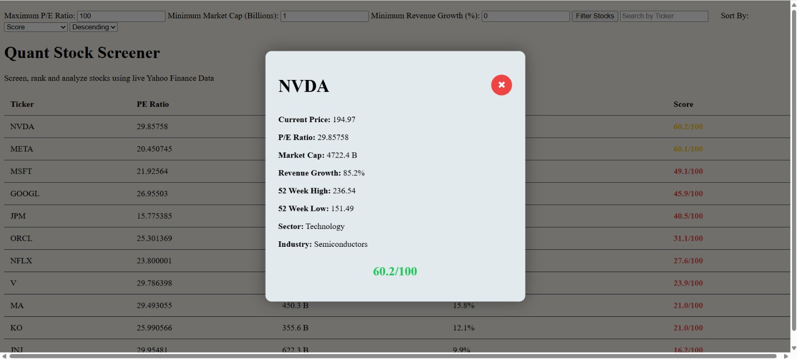

# Quant Stock Screener

A Python + JavaScript stock screener that fetches live market data using Yahoo Finance and allows users to filter, sort, and analyze stocks through a clean web interface.

---

## Features

- Live stock data from Yahoo Finance
- Filter by:
  - Maximum P/E Ratio
  - Minimum Market Cap (Billions)
  - Minimum Revenue Growth (%)
- Search stocks by ticker
- Sort by:
  - Investment Score
  - P/E Ratio
  - Market Cap
  - Revenue Growth
  - Ticker
- Investment Score (/100)
- Clickable stock details popup
- Automatic data refresh

---

## 🛠 Tech Stack

- Python
- Pandas
- NumPy
- yfinance
- HTML
- CSS
- JavaScript

---

## Screenshot



---

## Installation

Clone the repository

```bash
git clone <your-repository-url>
```

Install dependencies

```bash
pip install -r requirements.txt
```

Generate the stock data

```bash
python screener.py
```

Run the local server

```bash
python -m http.server
```

Open

```
http://localhost:8000
```

---

## Future Improvements

- Support 100+ stocks
- Better investment scoring
- Additional financial metrics
- More advanced filtering
- Improved UI/UX

---

Built as part of my Quant Finance Projects series.